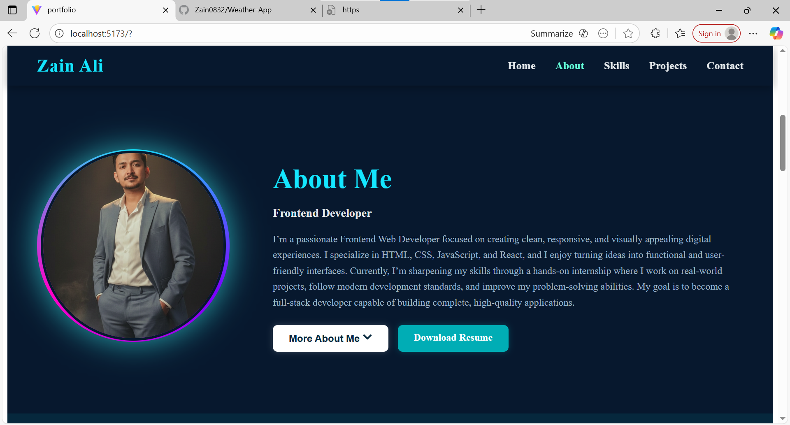
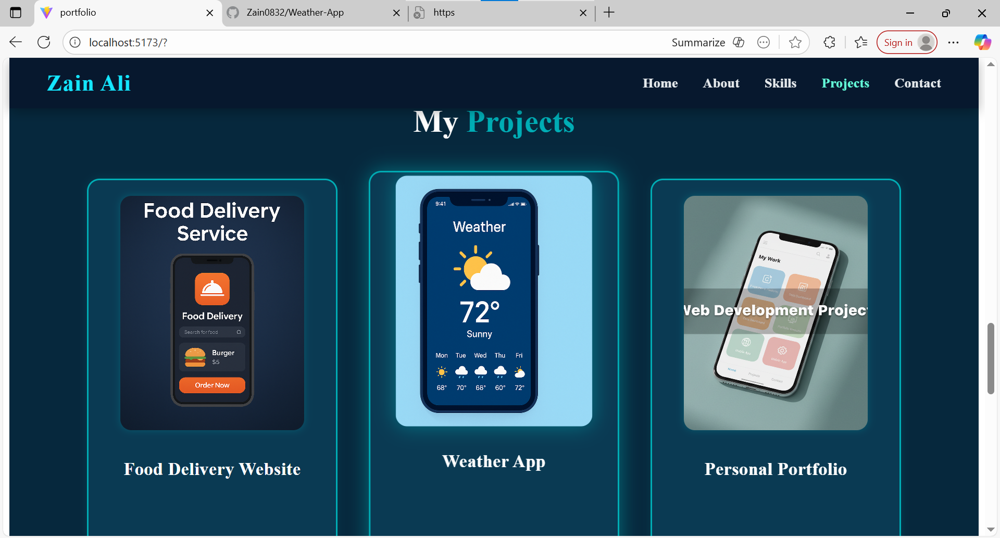
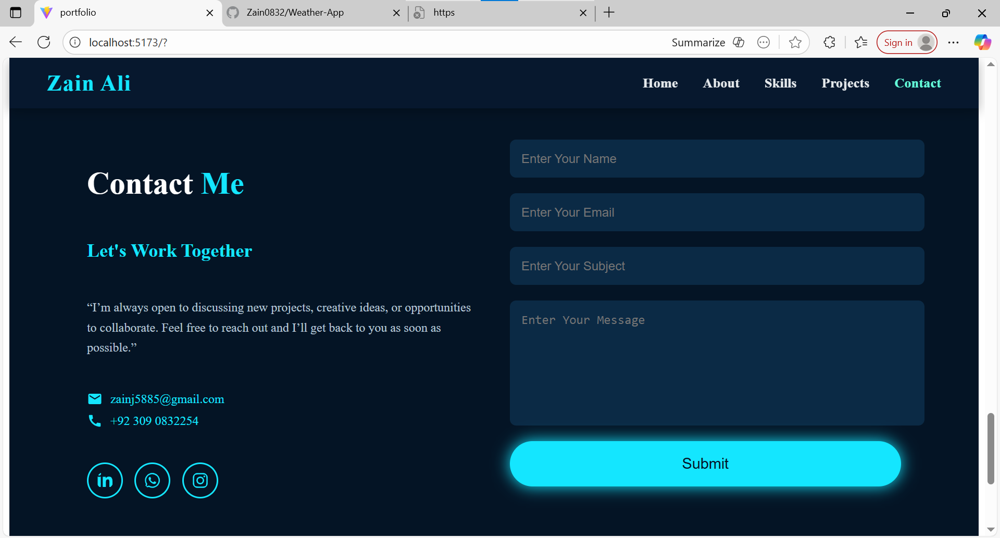

# Zain Ali - Portfolio Website

This is a personal portfolio website built with **React.js**.  
It showcases my **skills**, **projects**, and **contact information** with interactive animations and a modern design.

---

## 🌟 Features

- Fully responsive design for mobile, tablet, and desktop
- Animated **Skills Section** (technical skill bars + circular professional skills)
- Interactive **Projects Section** with hover glow, pulse, and buttons
- Contact form with animation and social links
- Smooth scroll animations on all sections
- Clean and modular React component structure

---

## 🗂 Project Structure


Portfolio/
│
├── public/
│ ├── index.html
│ └── favicon.ico
│
├── src/
│ ├── assets/ # Images, icons, project screenshots
│ │ ├── screenshot-hero.png
│ │ ├── screenshot-projects.png
│ │ ├── screenshot-skills.png
│ │ ├── screenshot-contact.png
│ │ └── project1.png
│ │
│ ├── components/
│ │ ├── Navbar/
│ │ ├── Hero/
│ │ ├── Skills/
│ │ ├── Projects/
│ │ ├── Contact/
│ │ └── Footer/
│ │
│ ├── App.jsx
│ └── index.js
│
├── package.json
├── package-lock.json
├── .gitignore
└── README.md


---

## 🖼 Screenshots

### Hero Section


### Projects Section


### Skills Section


### Contact Section


---

## ⚙ Installation

1. Clone the repository:
```bash
git clone <YOUR-REPO-URL>


Navigate to the project folder:

cd Portfolio


Install dependencies:

npm install


Start the development server:

npm start


The website will open in your browser at http://localhost:3000.

📌 Technologies Used

React.js

JavaScript (ES6+)

CSS3 / Flexbox / Grid

React Icons

Intersection Observer API

Git & GitHub

✨ How It Works

Skills Section:

Technical skills bars and professional circular skills animate every time they enter the viewport.

Projects Section:

Cards have hover animations including glow, pulse, and scale effects.

Contact Section:

Form fields animate into view with staggered effects.

Responsive layout for all device sizes.